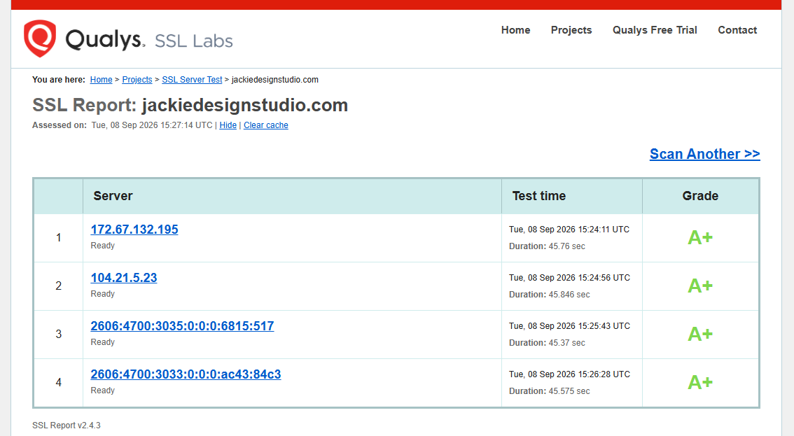
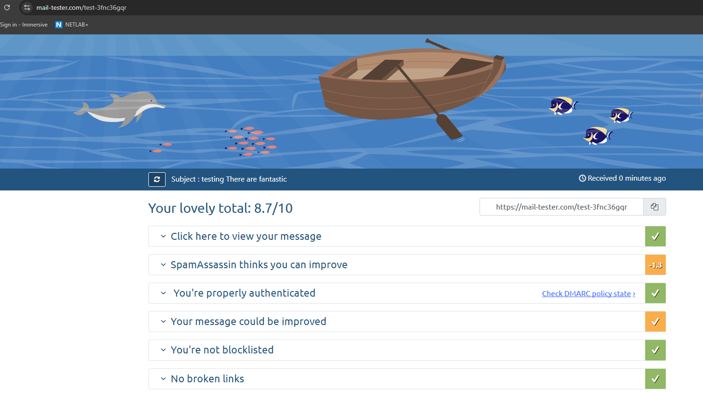
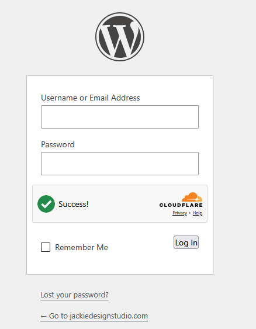
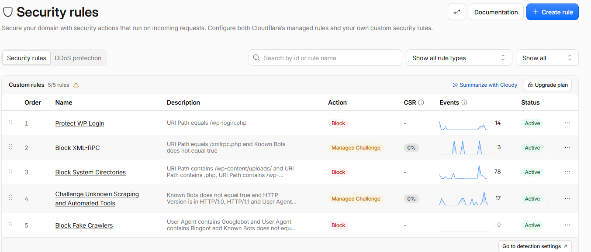
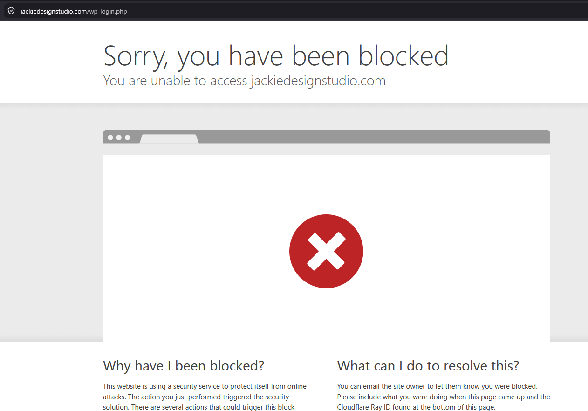
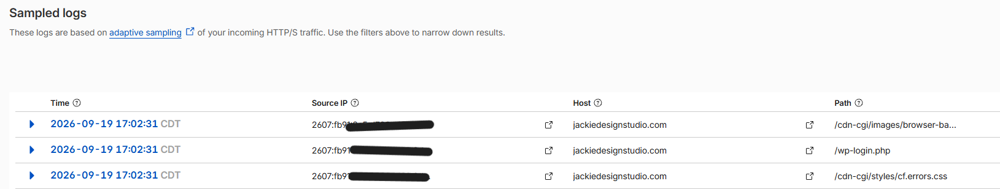

# boutique-ecommerce-hardening
A case study in hardening a live WooCommerce storefront using right-sized defense-in-depth security architectures
markdown# 💎 Project: Securing a Boutique Storefront on a Budget
**Target Platform:** WordPress, WooCommerce, Hostinger, Cloudflare  
**Live Site:** [jackiedesignstudio.com](https://jackiedesignstudio.com)

### The Philosophy: Right-Sized Security
Enterprise companies solve security by throwing millions at software like Splunk. Small businesses face the exact same threats—automated carding bots, scraper networks, and credential stuffing—but must operate on tight margins. 

This project demonstrates **Right-Sized Security**: building a defense-in-depth architecture using free and low-cost infrastructure. The goal was to secure the shop, protect proprietary jewelry designs, and build customer trust without expensive enterprise software.

### Defensive Layers Implemented

* **Edge Layer (Cloudflare):**
  * Swapped intrusive old CAPTCHAs for **Cloudflare Turnstile** to block bots invisibly, preserving the boutique's luxury checkout experience.
  * Created custom WAF rules to drop traffic targeting standard administrative files like `/wp-login.php`.
  * Activated **Scrape Shield** and AI Crawl Control to stop scrapers from stealing custom jewelry photos and flooding contact forms.

* **Access Layer (WordPress):**
  * Enforced the **Principle of Least Privilege (PoLP)** by removing default setups, creating a restricted "Shop Manager" role for daily operations, and isolating administrative duties.
  * Hidden the staff login area behind a custom slug (`/orange`) while customers safely use native WooCommerce endpoints (`/my-account/`).
  * Enabled mandatory **MFA (2FA)** for staff paired with offline single-use backup codes to mitigate lockout risks.
  * Configured backend IP tracking to read `CF-Connecting-IP` so local security plugins ban true malicious devices instead of Cloudflare proxy servers.

* **Server Layer (Hostinger):**
  * Turned `display_errors` **OFF** to hide system directories from the public, but turned `log_errors` **ON** to save logs privately inside the hosting portal.
  * Populated the `disable_functions` array to block direct server operating system commands (`exec`, `system`, `shell_exec`), rendering uploaded backdoors completely inert.

---

### Visual Proof of Concept (PoC)
#### 1. Baseline Encryption & Authentication Audits
Before traffic ever reaches the backend, the edge network and communication paths were stress-tested using standard industry diagnostic suites to establish a secure baseline.

  
   
  <i>Figure 1: Qualys SSL Labs diagnostic audit confirming a flawless A+ rating, verifying robust edge proxy shielding and elite cryptographic TLS configurations.</i>

  
   
  <i>Figure 2: Transactional email security verification showing a healthy 8.7/10 baseline with full SPF, DKIM, and DMARC cryptographic alignment.</i>

  <strong>Analyst Note on Email Diagnostics:</strong> The minor 1.3-point deduction stems from a temporary "New Domain" penalty (automatic for domains under 28 days old) and a missing HTML structural wrapper due to sending a raw text template. Core cryptographic authentication mechanisms passed with a 100% success rate.

#### 2. Perimeter Access Controls & Identity Management
Anti-automation defenses were placed at vulnerable authentication nodes to distinguish real human users from programmatic botnets.

  
   
  <i>Figure 3: Cloudflare Turnstile successfully running zero-friction browser telemetry verification on the CMS administrative portal.</i>

#### 3. Web Application Firewall (WAF) Deployment & Penetration Testing
To verify the deployment of the perimeter defenses, a simulated probing attack was executed against protected endpoints to validate the real-time blocking capabilities of the edge proxy nodes.

  
   
  <i>Figure 4: Active 5-layer Web Application Firewall (WAF) matrix mapping optimized conditional expressions to absolute edge mitigation behaviors.</i>

  
   
  <i>Figure 5: Real-time edge interception page served to simulated malicious entities attempting access to the hidden /wp-login.php pathway.</i>

  
   
  <i>Figure 6: Sampled network security logs verifying the immediate edge drop of the malicious /wp-login.php request at 17:02:31 CDT, accompanied by proper data redaction protocols.</i>

